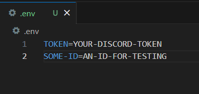
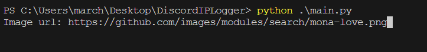

# **Discord IP Logger**
A Discord IP Logger tool easy to use.

## How to setup and use

1. First of all you will need to enter your user token and the ID of a channel for testing (don't add the ID of the user who you want to send the link). To get your own token I let you search on youtube. For the ID open your PM's and and select a bot, then copy its ID and paste id in "SOME-ID":
   

2. Execute the file with `python main.py` or whatever python command you have.
3. It will ask you for an image url, this is obvious so just provide an image url:

4. Then it will return you a discordapp.net link. That's your proxy url. When pasting it in a discord channel it will render the image and when a user wheel click the image it will redirect hom to the original image url.

## Real IP Logger
Of course for a real ip logger you will have to do something like this:
1. Create an image storage in your VPS.
2. Configure it to be able to save visitors data.
3. Get the link of a tricky image that can make the victim wheel click the image.
4. And you just have to provide that link to the script :)